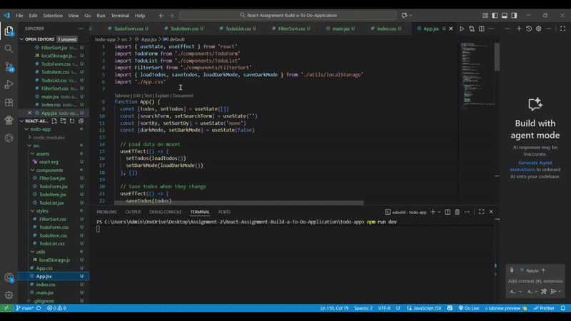
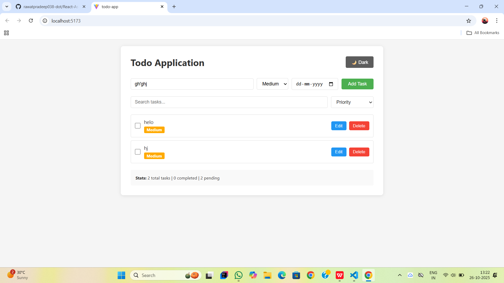
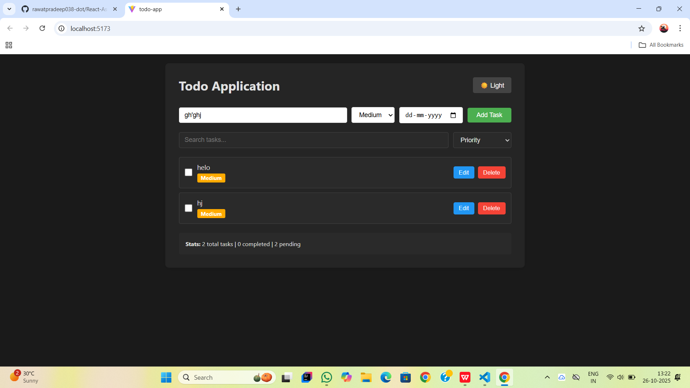

# 📝 React Todo Application

A fully functional, feature-rich Todo application built with React.js, featuring task management with priorities, due dates, search functionality, sorting options, and dark mode support.

 

## 🌟 Features

### Core Features
- ✅ **Add Tasks** - Create new tasks with ease
- ✏️ **Edit Tasks** - Modify existing tasks inline
- ✔️ **Mark as Complete** - Toggle task completion status
- 🗑️ **Delete Tasks** - Remove unwanted tasks
- 💾 **Local Storage** - Tasks persist across browser sessions

### Advanced Features
- 🎯 **Priority Levels** - Assign High, Medium, or Low priority to tasks
- 📊 **Sort by Priority** - Organize tasks by importance
- 📅 **Due Dates** - Set deadlines for your tasks
- ⚠️ **Overdue Highlighting** - Visual indicators for overdue tasks
- 🔍 **Search Functionality** - Filter tasks by name
- 🌓 **Dark Mode** - Toggle between light and dark themes
- 📈 **Task Statistics** - View total, completed, and pending tasks

## 🎥 Demo

### Video Walkthrough

<div align="center">
  
  <p><em>Complete feature demonstration of the Todo Application</em></p>
</div>

## 📸 Screenshots

### Light Mode


### Dark Mode


## 🛠️ Technologies Used

- **React 18** - UI Library
- **Vite** - Build tool and development server
- **CSS3** - Styling
- **Local Storage API** - Data persistence
- **JavaScript ES6+** - Programming language

## 📋 Prerequisites

Before running this project, make sure you have:

- **Node.js** (v14 or higher) - [Download here](https://nodejs.org/)
- **npm** (comes with Node.js) or **yarn**
- A modern web browser (Chrome, Firefox, Safari, or Edge)
- Git (for version control)

## 🔧 Installation

### 1. Clone the Repository
```bash
git clone https://github.com/rawatpradeep038-dot/todo-app.git
cd todo-app
```

### 2. Install Dependencies
```bash
npm install
```

or if you're using yarn:
```bash
yarn install
```

### 3. Start Development Server
```bash
npm run dev
```

or with yarn:
```bash
yarn dev
```

### 4. Open in Browser

Navigate to `http://localhost:5173` in your web browser.

## 📁 Project Structure
```
todo-app/
├── src/
│   ├── components/             # React components
│   │   ├── TodoForm.jsx       # Form to add new tasks
│   │   ├── TodoItem.jsx       # Individual task item
│   │   ├── TodoList.jsx       # List of all tasks
│   │   └── FilterSort.jsx     # Search and sort controls
│   ├── styles/                 # CSS files
│   │   ├── TodoForm.css       # Styles for TodoForm
│   │   ├── TodoItem.css       # Styles for TodoItem
│   │   ├── TodoList.css       # Styles for TodoList
│   │   └── FilterSort.css     # Styles for FilterSort
│   ├── utils/                  # Utility functions
│   │   └── localStorage.js    # LocalStorage operations
│   ├── App.jsx                 # Main App component
│   ├── App.css                 # App-level styles
│   ├── index.css               # Global styles
│   └── main.jsx                # Entry point
├── package.json                # Dependencies and scripts
├── vite.config.js             # Vite configuration
└── README.md                   # Project documentation
```

## 💡 Usage Guide

### Adding a Task
1. Type your task in the input field
2. Select a priority level (High/Medium/Low)
3. Optionally set a due date
4. Click "Add Task" button

### Editing a Task
1. Click the "Edit" button on any task
2. Modify the task details
3. Click "Save" to confirm or "Cancel" to discard changes

### Marking as Complete
- Click the checkbox next to any task to toggle its completion status

### Deleting a Task
- Click the "Delete" button on any task to remove it permanently

### Searching Tasks
- Type in the search bar to filter tasks by name (case-insensitive)

### Sorting Tasks
Use the dropdown menu to sort by:
- **Priority** - High → Medium → Low
- **Due Date** - Earliest to latest
- **Created Date** - Newest to oldest

### Dark Mode
- Click the "🌙 Dark" or "☀️ Light" button in the header to toggle themes

## 🎨 Styling

The application uses a clean, minimal design with:
- Responsive layout that works on mobile and desktop
- Color-coded priority badges (Red: High, Orange: Medium, Green: Low)
- Smooth transitions and hover effects
- Overdue tasks highlighted with red accent
- Dark mode with carefully selected colors for reduced eye strain

## 💾 Data Persistence

All tasks are automatically saved to browser's localStorage:
- Tasks persist even after closing the browser
- Dark mode preference is remembered
- No backend or database required

## 🧪 Available Scripts
```bash
npm run dev          # Start development server
npm run build        # Build for production
npm run preview      # Preview production build locally
npm run lint         # Run ESLint for code quality
```

## 🌐 Building for Production
```bash
npm run build
```

This creates an optimized production build in the `dist/` folder, ready for deployment.

## 🐛 Known Issues

- None currently reported

## 🔮 Future Enhancements

- [ ] Add task categories/tags
- [ ] Export/Import tasks as JSON
- [ ] Add recurring tasks
- [ ] Task reminders/notifications
- [ ] Drag and drop to reorder tasks
- [ ] Multiple task lists
- [ ] Cloud sync across devices
- [ ] Task sharing functionality

## 🤝 Contributing

Contributions are welcome! Please follow these steps:

1. Fork the repository
2. Create a new branch (`git checkout -b feature/YourFeature`)
3. Commit your changes (`git commit -m 'Add some feature'`)
4. Push to the branch (`git push origin feature/YourFeature`)
5. Open a Pull Request

## 📝 Assignment Requirements Checklist

- [x] Built from scratch (not copied from session)
- [x] Add new task
- [x] Mark task as completed
- [x] Delete task
- [x] Edit task
- [x] LocalStorage persistence
- [x] Priority levels (High/Medium/Low)
- [x] Sort by priority
- [x] Search bar to filter tasks
- [x] Clean styling
- [x] Due dates with overdue highlighting (Bonus)
- [x] Dark mode toggle (Bonus)
- [x] Hosted on GitHub

## 📄 License

This project is open source and available under the [MIT License](LICENSE).

## 👨‍💻 Author

**Pradeep Singh Rawat**
- GitHub: [@rawatpradeep038-dot](https://github.com/rawatpradeep038-dot)
- LinkedIn: [linkedin.com/in/pradeepsinghrawat038](https://linkedin.com/in/pradeepsinghrawat038)
- Email: rawatpradeep038@gmail.com

## 🙏 Acknowledgments

- Created as part of React.js learning assignment
- Thanks to Cepia Labs for the assignment guidelines
- Icons: Unicode emoji characters

## 📞 Support

If you have any questions or run into issues:

1. Create a new issue with detailed description
2. Contact: rawatpradeep038@gmail.com

---

⭐ If you found this project helpful, please give it a star!

Made with ❤️ and React by Pradeep Singh Rawat